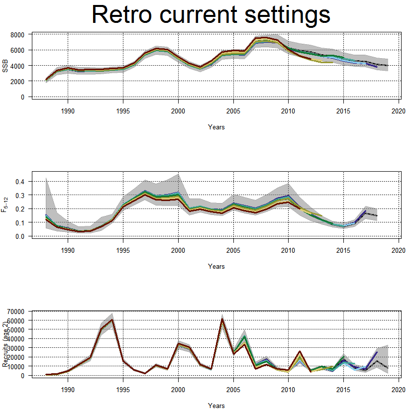

---
output:
  html_document: default
  pdf_document: default
---
```{r echo=FALSE, eval=TRUE, results='hide',include=FALSE}
library(TMB)
library(mgcv)
library(Matrix)
library(stockassessment)
load("fitStandard.Rda")
load("fitCurrent.Rda")
```


## **Norwegian Spring Spawning Herring** 
In this case study you learn to:

* run SAM with XSAM-options for Norwegian Spring Spawning Herring.
* validate a SAM assessment.
* set TAC for herring with XSAM options.

In thic case study it is assumed that you have a good overview of how SAM works. If you want to learn more about the therory behind SAM and how it is implemented, see [https://github.com/skaug/tmb-case-studies/tree/master/SAM](https://github.com/skaug/tmb-case-studies/tree/master/SAM) for case studies which elaborate SAM. 


To run a SAM model can be divided into five standard steps:

1. Read data
2. Set up SAM data
3. Set up configurations
4. Define parameters
5. Fit SAM

In this case study we illustrates how to modify these parts to use settings from XSAM. We start with fitting a standard SAM with the herring data, and then extend the model to include XSAM options currently used in the herring assessment. 

***
### Standard SAM model

<details>  
  <summary>Read data</summary>
```r
  cn<-read.ices("data/Herring/cn.dat")
  cw<-read.ices("data/Herring/cw.dat")
  dw<-read.ices("data/Herring/dw.dat")
  lf<-read.ices("data/Herring/lf.dat")
  lw<-read.ices("data/Herring/lw.dat")
  mo<-read.ices("data/Herring/mo.dat")
  nm<-read.ices("data/Herring/nm.dat")
  pf<-read.ices("data/Herring/pf.dat")
  pm<-read.ices("data/Herring/pm.dat")
  sw<-read.ices("data/Herring/sw.dat")
  surveys<-read.ices("data/Herring/survey.dat")
```
</details>

<details>  
  <summary>Setup SAM data</summary>
```r
  dat<-setup.sam.data(surveys=surveys,
                      residual.fleet=cn, 
                      prop.mature=mo, 
                      stock.mean.weight=sw, 
                      catch.mean.weight=cw, 
                      dis.mean.weight=dw, 
                      land.mean.weight=lw,
                      prop.f=pf, 
                      prop.m=pm, 
                      natural.mortality=nm, 
                      land.frac=lf)
```
</details>

<details>  
  <summary>Set configurations</summary>
```r
  conf = loadConf(dat,"scripts/Herring/confStandard.cfg")
```
  <em>Note: Use almost the default settings, we will later encounter some convergence issues if we use the default settings.</em>
</details>

<details>  
  <summary>Define parameters</summary>
```r
  par<-defpar(dat,conf)
```
</details>

<details>  
  <summary>Fit SAM</summary>
```r
  fitStandard<-sam.fit(dat,conf,par)
```
</details>


***

### SAM model with currently used XSAM options
<details>  
  <summary>Read data</summary>
```r
  cn<-read.ices("data/herring/cn.dat")
  cw<-read.ices("data/herring/cw.dat")
  dw<-read.ices("data/herring/dw.dat")
  lf<-read.ices("data/herring/lf.dat")
  lw<-read.ices("data/herring/lw.dat")
  mo<-read.ices("data/herring/mo.dat")
  nm<-read.ices("data/herring/nm.dat")
  pf<-read.ices("data/herring/pf.dat")
  pm<-read.ices("data/herring/pm.dat")
  sw<-read.ices("data/herring/sw.dat")
  surveys<-read.ices("data/herring/survey.dat")
```
</details>

<details>  
  <summary>Read variance estimates</summary>
```r
  varC = as.matrix(read.table("data/herring/varC.txt", sep = " "))
  varS1 = as.matrix(read.table("data/herring/varS1.txt", sep = " "))
  varS2 = as.matrix(read.table("data/herring/varS2.txt", sep = " "))
  varS3 = as.matrix(read.table("data/herring/varS3.txt", sep = " "))
```
</details>

<details>  
  <summary>Set the variance estimates as invese weight attributes to the catch and surveys</summary>
```r
  attributes(cn)$weight = 1/(varC)
  attributes(surveys[[1]])$weight = 1/(varS1)
  attributes(surveys[[2]])$weight = 1/(varS2)
  attributes(surveys[[3]])$weight = 1/(varS3)
```
</details>

<details>  
  <summary>Setup SAM data</summary>
```r
  dat<-setup.sam.data(surveys=surveys,
                      residual.fleet=cn, 
                      prop.mature=mo, 
                      stock.mean.weight=sw, 
                      catch.mean.weight=cw, 
                      dis.mean.weight=dw, 
                      land.mean.weight=lw,
                      prop.f=pf, 
                      prop.m=pm, 
                      natural.mortality=nm, 
                      land.frac=lf)
```
  <em>Note: The external variance estimates are now included in `dat$weigth`. When we later fit SAM, the model will use these variance estimates when weighting the data sources.</em>
</details>

<details>  
  <summary>Set currently used configurations</summary>
```r
  conf<-loadConf(dat,"scripts/herring/model.cfg", patch=TRUE)
```
  <em>Note: Key features here are `corFlag`, `stockRecruitmentModelCode` and `keyVarObs`. Make sure you understand how these settings are used to define the model. </em>
</details>

<details>  
  <summary>Define parameters</summary>
```r
  par<-defpar(dat,conf)
```
</details>

<details>  
  <summary>Set process error to approximately zero</summary>
```r
  par$logSdLogN = c(-0.35,-6)
  map = list(logSdLogN = as.factor(c(0,NA)))
```
  <em>Note: The `map` variable informs `sam.fit` that the process error are to be kept to its initial value, which is approximately zero.</em>
</details>

<details>  
  <summary>Fit SAM</summary>
```r
  fitCurrent<-sam.fit(dat,conf,par,map = map)
```
</details>


***
## Evaluate assessment
The assessment is based on a given set of configuration settings. We will now validate these settings and the model used. In this section we will look at the following three key features:

1. AIC
2. OSA residuals
3. Retrospective patterns

<details>  
  <summary>AIC</summary>
```{r}
  AIC(fitStandard, fitCurrent)
```
  <em>Note: The relatively standard used settings give much lower AIC, meaning that the model fits data significantly better.</em>
</details>

<details>  
  <summary>OSA-residals</summary>
```r
  resStandard = residuals(fitStandard) 
  resCurrent = residuals(fitCurrent)  
  plot(resStandard)
  plot(resCurrent)
```

</details>

<details>  
  <summary>Retrospective patterns</summary>
```r
  retroStandard = retro(fitStandard,year = 7) #Convergence fails. TODO: SAM uses a shortcut, can include a "slow"-option here
  retroCurrent = retro(fitCurrent,year = 7)
  plot(retroStandard)
  plot(retroCurrent)
```
    
</details>


***


## TAC for 2020
The target level of exploration is calculated with the following formula:
\begin{align}
  F_{tr}=
  \begin{cases}
  0.05 ,& \text{if } \text{SSB} \leq B_{lim}  \\
  0.14- 0.09\frac{B_{pa} - \text{SSB}}{B_{pa}-\text{B}_{lim}} ,& \text{if } \text{B}_{lim} < \text{SSB} \leq B_{pa}  \\
  0.14 ,& \text{if } \text{B}_{pa} < \text{SSB}
  \end{cases}
\end{align}
where $\text{B}_{lim} = 2.5$ million tonnes. and $\text{B}_{pa} = 3.184$ million tonnes.


In 2019 it is estimated to be caught 773 750 tons of herring. 
<details>  
  <summary>Predict SSB January 1st. 2020</summary>
```r
  set.seed(12345)
  forecast(fit,catchval.exact = c(773.750,0))
```
We predict the SSB to be approximately 3.783 million tonnes in 1st january 2020. By using the target level of exploration formula above, we want to target the fishing mortalty to $F_{tr} =  0.14$ in 2020. 
</details>


<details>  
  <summary>Forecast catches in 2020 corresponding to $F_{tr}$</summary>
```r
  set.seed(12345)
  forecast(fit,catchval.exact = c(773.750,NA), fval = c(NA,0.14)) #TODO: no option in SAM to use F-bar weighted with N
```
Estimated catch in 2020 is 503 000 tonnes, which is the advised TAC. 
</details>


***


## Propose new settings settings


Propose new configuration settings for Norwegian Spring Spawning Herring. Key features to modify are:

1. Coupling of observation variances
2. Correlation structure of observations
3. Model for fishing mortality


Propose several configuration settings, and argue which proposal is the best. You should also investigate retrospective plots and investigate with simulations that the model is able to estimate itself.

<details>  
  <summary>Simulation study</summary>
```r
  simStandard = simstudy(fitStandard,nsim = 10)
  ssbplot(simStandard)
```
    
</details>


***

## Additional assignment: Estimate weights inside SAM

The external variance estimates are in this example smoothed by the following procedure. Let $\mu_{a,y}$ be the observation for age $a$ at year $y$ on natural scale, and let $v_{a,y}$ be the correspondning variance. We assume that
\begin{align}
 v_{a,y} = \alpha \mu_{a,y}^\beta, 
\end{align}
and estimate $\alpha$ and $\beta$ outside of SAM. 

The equation above can be included internally in SAM. To estimate weights internally in SAM we need to install a development version of SAM. The development version can be installed by:

```r
devtools::install_github("fishfollower/SAM/stockassessment",ref = "FprocVarMeanLink")
```

Set the configurations to use internal weighting with the `meanWeigthObsV` option:

```r
  conf$meanVarObsLink = conf$keyVarObs
  par<-defpar(dat,conf)
  fit<-sam.fit(dat,conf,par)
```
<em>Note: Internally in SAM, $\log(\mu_{a,y})$ is replaced with the expected observation for age $a$ in year $y$. A documentation for the procedure is given as a vignette [here](https://github.com/fishfollower/SAM/tree/vignettes/stockassessment/vignettes).</em>


***


