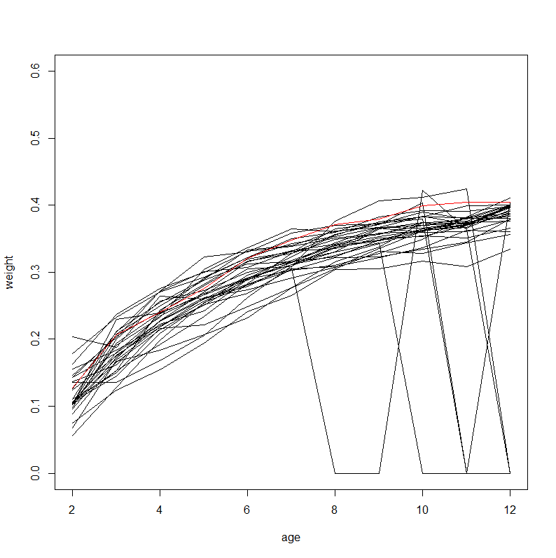
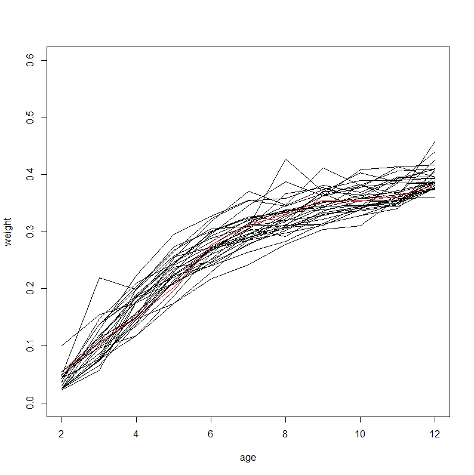
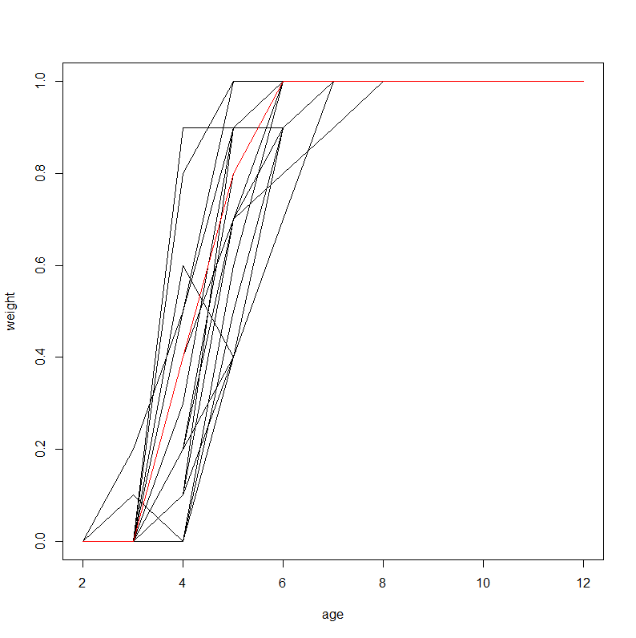
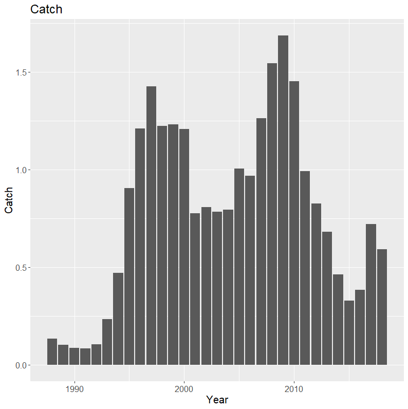
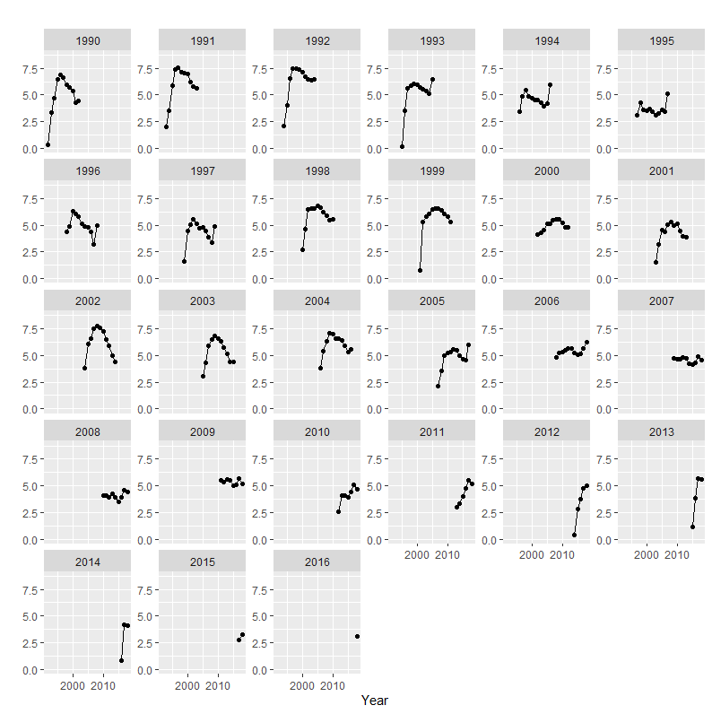
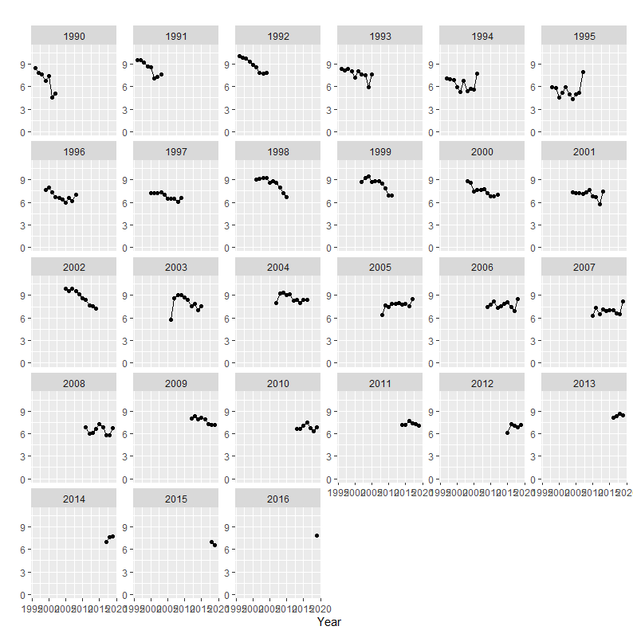
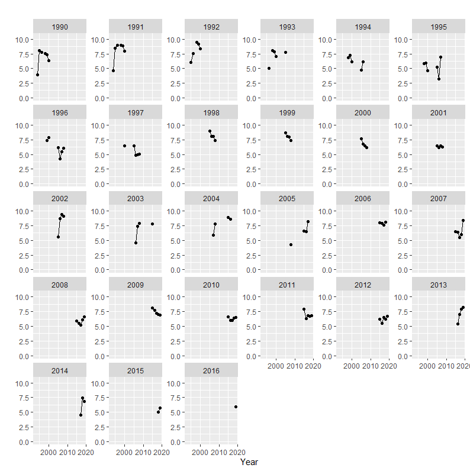
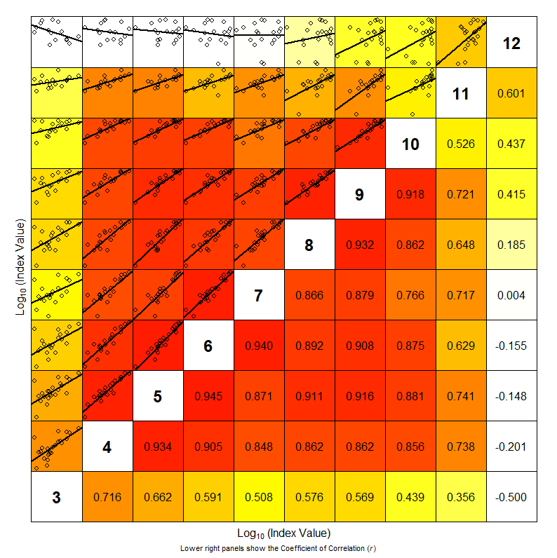
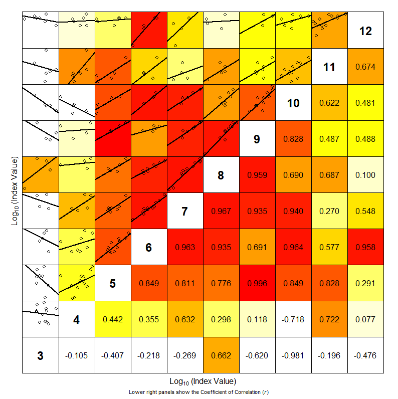

---
output:
  
  html_document: default
  pdf_document: default
---
```{r echo=FALSE, eval=TRUE, results='hide',include=FALSE}
library(stockassessment)
library(ggplot2)
source('script/utils.r')
```

### Looking at input data


## **Reading the data** 
In this exersise we will read and look at the input data

***

<details>  
  <summary>Read data</summary>
```r
#Read data
cn<-read.ices("Herring/cn.dat")
cw<-read.ices("Herring/cw.dat")
dw<-read.ices("Herring/dw.dat")
lf<-read.ices("Herring/lf.dat")
lw<-read.ices("Herring/lw.dat")
mo<-read.ices("Herring/mo.dat")
nm<-read.ices("Herring/nm.dat")
pf<-read.ices("Herring/pf.dat")
pm<-read.ices("Herring/pm.dat")
sw<-read.ices("Herring/sw.dat")
surveys<-read.ices("Herring/survey.dat")
```
</details>

## **Look at the catch weight** <details>  
  <summary>Plotting</summary>
```r
#Read data
plot(x=c(2,12),y=c(0,0.6),type='n',xlab='age',ylab='weight')
for(i in 1:length(cw[,1])){
  lines(2:12,cw[i,])
}
lines(2:12,cw[i,],col='red')

```
</details>





## **Look at the stock weight** 
  <summary>Plotting</summary>
```r
#Read data
plot(x=c(2,12),y=c(0,0.6),type='n',xlab='age',ylab='weight')
for(i in 1:length(sw[,1])){
  lines(2:12,sw[i,])
}
lines(2:12,sw[i,],col='red')

```
</details>



## **Look at the maturity ogive** 
  <summary>Plotting</summary>
```r
#Read data
plot(x=c(2,12),y=c(0,1),type='n',xlab='age',ylab='maturity')
for(i in 1:length(mo[,1])){
  lines(2:12,mo[i,])
}
lines(2:12,mo[i,],col='red')

```
</details>



## **Look at the cath ** 
  <summary>Plotting</summary>
```r
CatchPlot(cn*cw)
PlotCohort(cn)

```
First we have to look at the catch data. The first figure show the total catch per year. The assessor should see if the last entry is correct. The second figures show the catch curves per age. If anything looks strange the assessor should contact the stock coordinator for a data review. 







## **Look at the survey curves** 
  <summary>Plotting</summary>
```r
PlotCohort(surveys$SpawninggroundsalongtheNorwegiancoast*1000)
PlotCohort(surveys$FeedingareasintheNorwegianSeainMay*1000)

```







## **Look at the survey curves** 
  <summary>Plotting</summary>
```r
internalConsistancy(dat<-surveys$FeedingareasintheNorwegianSeainMay)
internalConsistancy(dat<-surveys$SpawninggroundsalongtheNorwegiancoast)

```




