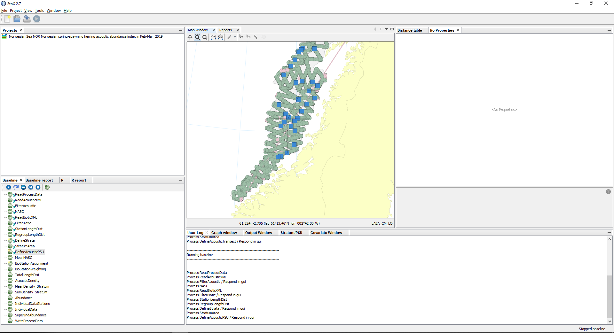
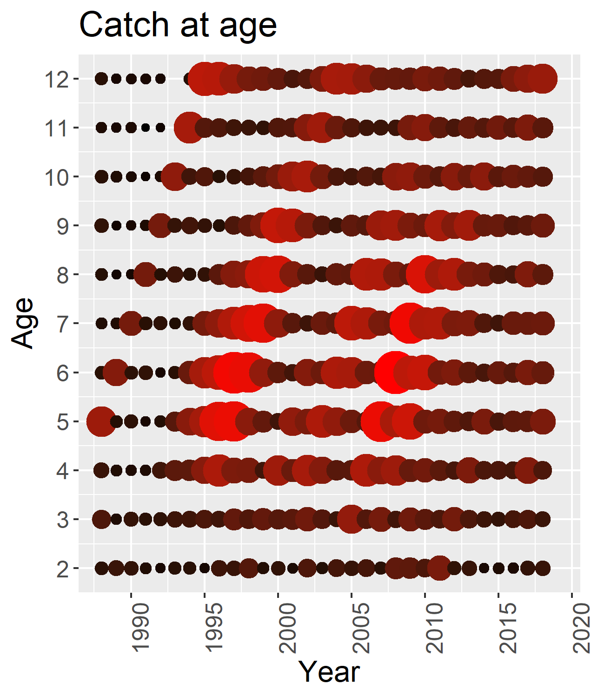
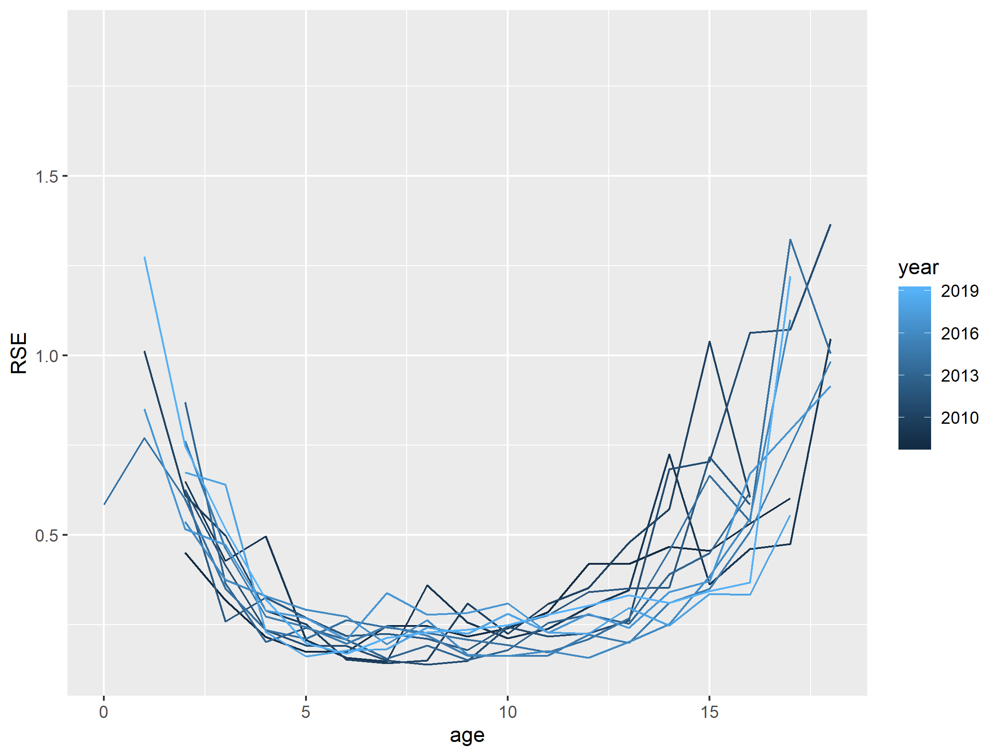
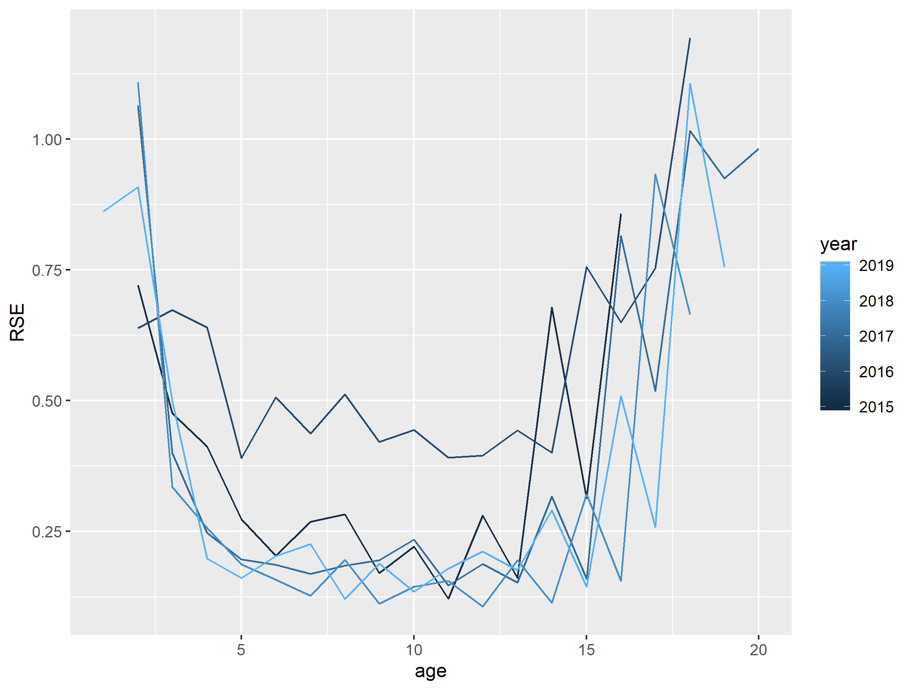
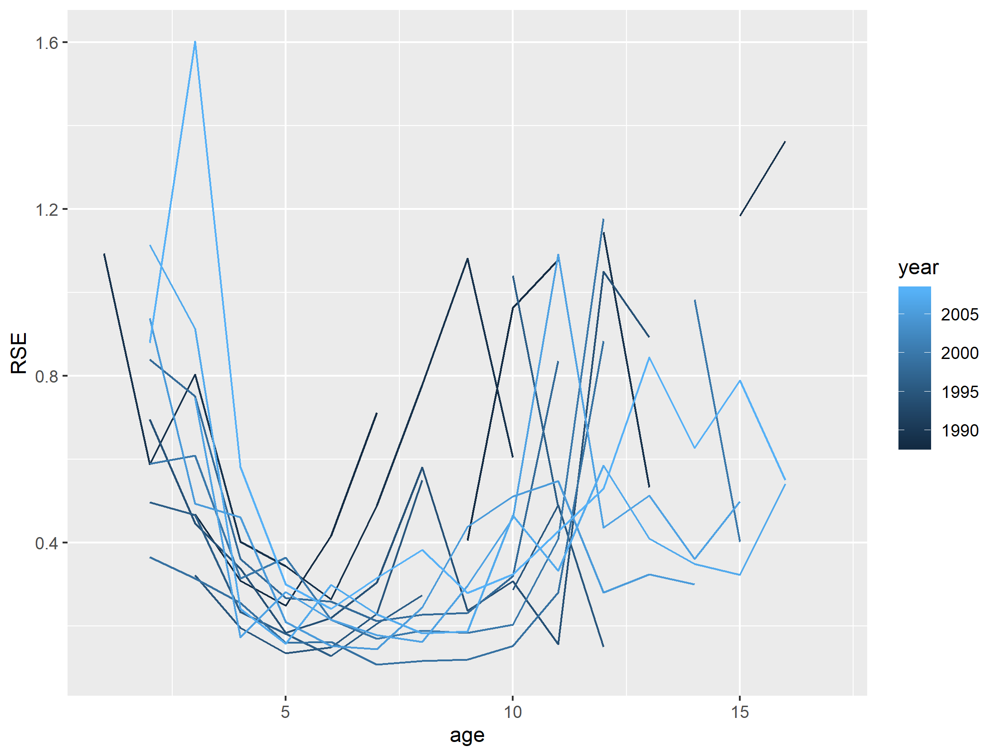

---
output:
  
  pdf_document: default
  html_document: default
---
```{r echo=FALSE, eval=TRUE, results='hide',include=FALSE}
library(stockassessment)
# source('../../utils.R')
# load("fitStandard.Rda")
# load("fitCurrent.Rda")
```


## **Making variance estimates from Stox replicates** 
The XSAM model uses the variance (uncertainty) from the input data to weight the different dataset.
In this case study you learn to:

* Look at the StoxReplicates
* Understand the function of an taylor approximation.
* Understand the assumption for the variance data on the Herring Assessment.

***


## **The StoX software** 
The StoX software is commonly used for develope index for several marine species. 

In the official releace of Rstox (https://github.com/Sea2Data/Rstox), the variance are computed through a bootstrap rutine. 

In an unofficial releace, the ECA model is implemented which computes the catch at age and the variance.




***

## **Taylor approximation** 
The reason for doing a taylor approximation is to smooth the variance and to be able to add variance to data that does not have this

$$v=k^{(2-\beta)}*(\alpha/n)*(\mu)^\beta$$
where v is the smoothed variance, $\mu$ is the either the catch or the index, $\alpha$ and $\beta$ is estimated using the linear relationship between variance from the data and $\mu$, and $k$ is a scaling factor between the reported index and the mean from stox replicates. 
      
***

## **Assumption of the data**
When preparing the data so it can be used into the assessment, we need to do some assumptions. For the NSSH we have made the following assumptions:   

1st assumption: 
Typically, the catch at age data (see cn) we aggregate the catch at age per nations. 
When the variance is to be computed we idealy need the 'raw' data, but, this is currently only avaliable for only the Norwegian data. 
Since the Norwegian quota represent a larger part of the TAC, we assume that the variance estimated from the Norwegian catch can be populated for the whole catch. This is done by adding a scaling factor k in the equation above.

2nd assumption: 
For the Catch at age data we only have variance estimates from 2011. To 'fill' inn the missing data we assume the taylor approximation is valid backwards in time, and use estimats from the taylor approximation to fill inn the missing data.

## **How does this weight the inputdata?**
the weight of the input data is set to be the inverce of its variance. From the figure we can clearly see a pattern in the inverce variance. 

* What does this information indicate? 




## **Some warnings**
For many assessment, there exist assumptions regarding the data. It is cruical to test these assumptions. 
Underneath we illustrate the assumption if we can use the taylor approximation. 


For the mai survey, the survey has been designed in an standardized manner.
<details>  
  <summary>Looking at the RSE for the mai survey</summary>
```r
replicate = read.csv('data/Herring/Variance/mai_replicate.txt')
ggplot(data=replicate,aes(x=age,y=RSE,group=year,colour=year))+geom_line()
```
</details>



For the spawning survey, the survey has been designed in a standardized manner since 2015. In 2016 the distribution of the herring was unfavorable fassion, resulting a higher uncertainty. This can be spotted in the RSE per age. 
<details>  
  <summary>Looking at the RSE for the spawning survey (2015 - 2019)</summary>
```r
replicate<-replicate[replicate$year>=2015,]
ggplot(data=replicate,aes(x=age,y=RSE,group=year,colour=year))+geom_line()
```
</details>

Before 2015, the spawing survey was not conducted in a standardized manner. I.e. the design where different, as well as the timing and the covered area. we see the RSE is quite different than for the same survey but from 2015. 

* What will happen if we use use the taylor approximation? 
* What happen if we assume the spawning survey to be two different timeseries? 
* What happen if we remove the data before 2015?

<details>  
  <summary>Looking at the RSE for the spawning survey (before 2015)</summary>
```r
replicate<-replicate[replicate$year<2015,]
ggplot(data=replicate,aes(x=age,y=RSE,group=year,colour=year))+geom_line()
```
</details>
