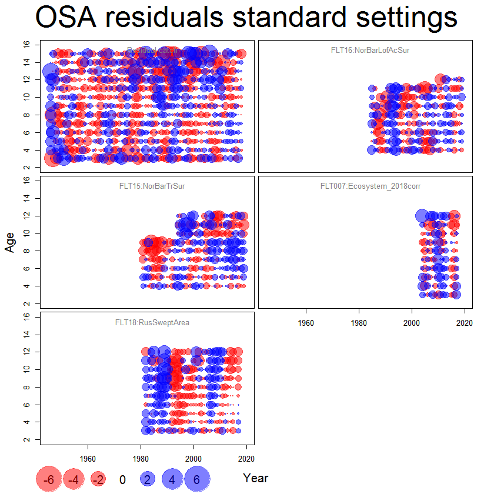
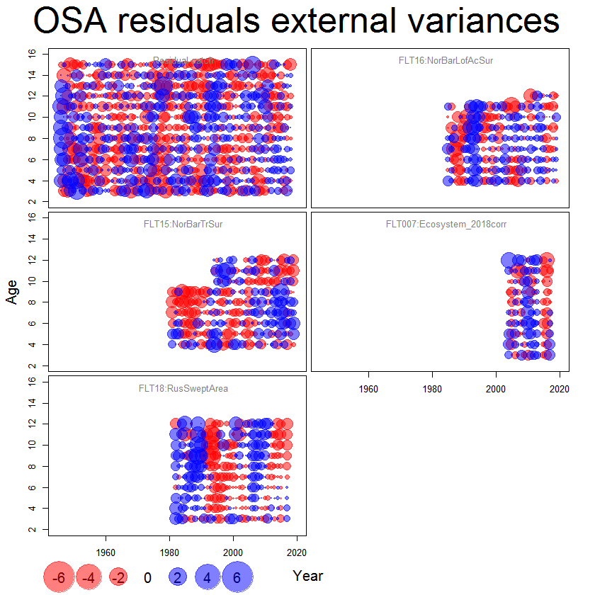
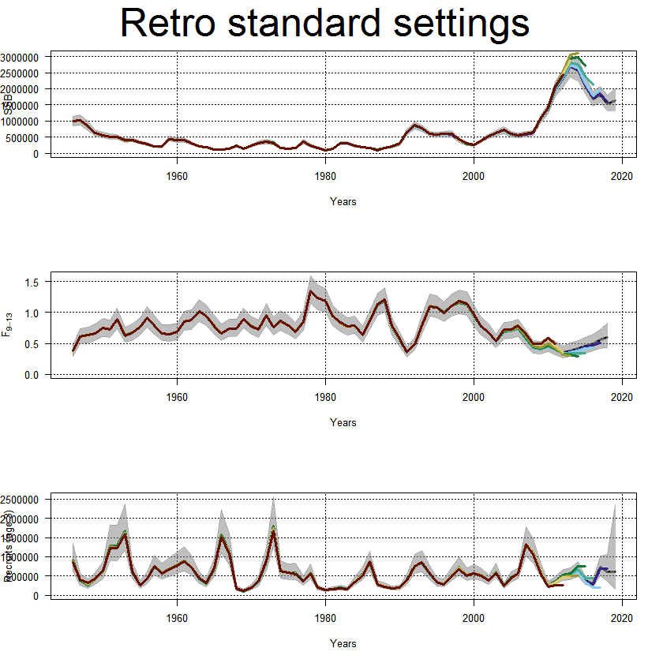
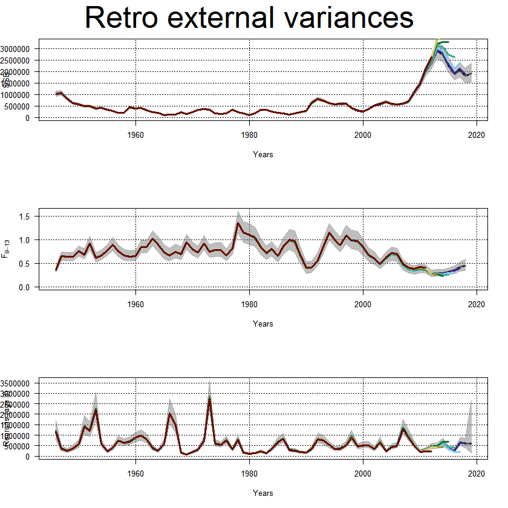

---
output:
  html_document: default
  pdf_document: default
---
```{r echo=FALSE, eval=TRUE, results='hide',include=FALSE}
library(stockassessment)
load("fitStandard.Rda")
load("fitWithVar.Rda")
```


## **North East Arctic Cod** 
In this example you learn how to:

* run SAM for NEAcod
* validate a SAM assessment.
* set TAC for NEAcod


In thic case study it is assumed that you have a good overview of how SAM works. If you want to learn more about the therory behind SAM and how it is implemented, see [https://github.com/skaug/tmb-case-studies/tree/master/SAM](https://github.com/skaug/tmb-case-studies/tree/master/SAM) for case studies which elaborate SAM. 


To run a SAM model can be divided into five standard steps:

1. Read data
2. Set up SAM data
3. Set up configurations
4. Define parameters
5. Fit SAM

In this case study we illustrates how to modify these parts to utilize different structures in the data. We start with fitting a standard SAM with the cod data, and then look at the effect of modifying the model configurations. 

***
### Fit standard SAM model

<details>  
  <summary>Read data</summary>
```r
  cn<-read.ices("data/NEAcod/cn.dat")
  cw<-read.ices("data/NEAcod/cw.dat")
  dw<-read.ices("data/NEAcod/dw.dat")
  lf<-read.ices("data/NEAcod/lf.dat")
  lw<-read.ices("data/NEAcod/lw.dat")
  mo<-read.ices("data/NEAcod/mo.dat")
  nm<-read.ices("data/NEAcod/nm.dat")
  pf<-read.ices("data/NEAcod/pf.dat")
  pm<-read.ices("data/NEAcod/pm.dat")
  sw<-read.ices("data/NEAcod/sw.dat")
  surveys<-read.ices("data/NEAcod/survey.dat")
```
</details>

<details>  
  <summary>Setup SAM data</summary>
```r
  dat<-setup.sam.data(surveys=surveys,
                      residual.fleet=cn, 
                      prop.mature=mo, 
                      stock.mean.weight=sw, 
                      catch.mean.weight=cw, 
                      dis.mean.weight=dw, 
                      land.mean.weight=lw,
                      prop.f=pf, 
                      prop.m=pm, 
                      natural.mortality=nm, 
                      land.frac=lf)
```
</details>

<details>  
  <summary>Set configurations</summary>
```r
  conf = defcon(dat)
```
</details>


<details>  
  <summary>Set parameters</summary>
```r
  par<-defpar(dat,conf)
```
</details>


<details>  
  <summary>Fit SAM</summary>
```r
  fit<-sam.fit(dat,conf,par)
```
</details>


***

### Fit SAM model with XSAM options
In this example we include external variance estimates and default SAM configurations. 
<details>  
  <summary>Read data</summary>
```r
  cn<-read.ices("data/NEAcod/cn.dat")
  cw<-read.ices("data/NEAcod/cw.dat")
  dw<-read.ices("data/NEAcod/dw.dat")
  lf<-read.ices("data/NEAcod/lf.dat")
  lw<-read.ices("data/NEAcod/lw.dat")
  mo<-read.ices("data/NEAcod/mo.dat")
  nm<-read.ices("data/NEAcod/nm.dat")
  pf<-read.ices("data/NEAcod/pf.dat")
  pm<-read.ices("data/NEAcod/pm.dat")
  sw<-read.ices("data/NEAcod/sw.dat")
  surveys<-read.ices("data/NEAcod/survey.dat")
```
</details>

<details>  
  <summary>Include variance estimates</summary>
```r
  varC = as.matrix(read.table("data/NEAcod/variances/varCatch.txt", sep = " "))
  attributes(cn)$weight = 1/varC
  varS1 = as.matrix(read.table("data/NEAcod/variances/varFLT15Cod.txt", sep = " "))
  attributes(surveys[[1]])$weight = 1/varS1
```
  <em>Note: We only have variance estimates of catch and survey FLT15.</em>
</details>

<details>  
  <summary>Setup SAM data</summary>
```r
  dat<-setup.sam.data(surveys=surveys,
                      residual.fleet=cn, 
                      prop.mature=mo, 
                      stock.mean.weight=sw, 
                      catch.mean.weight=cw, 
                      dis.mean.weight=dw, 
                      land.mean.weight=lw,
                      prop.f=pf, 
                      prop.m=pm, 
                      natural.mortality=nm, 
                      land.frac=lf)
```
</details>

<details>  
  <summary>Set configurations</summary>
```r
  conf = defcon(dat)
```
  <em>Note: We use default settings, the only XSAM setting here used are the inclution of the external variance estimates.</em>
</details>

<details>  
  <summary>Set parameters</summary>
```r
  par<-defpar(dat,conf)
```
</details>

<details>  
  <summary>Fit SAM</summary>
```r
  fitWithVar<-sam.fit(dat,conf,par)
```
</details>

***
### Evaluate assessment
The assessment is based on a given set of configuration settings. We will now validate these settings and the model used. In this section we will look at the following three key features:

1. AIC
2. OSA residuals
3. Retrospective patterns

<details>  
  <summary>AIC</summary>
```{r}
  AIC(fitStandard, fitWithVar)
```
  <em>Note: Using the external variance estimates gives much lower AIC, meaning that the model fits data significantly better.</em>
</details>

<details>  
  <summary>OSA-residals</summary>
```r
  resStandard = residuals(fitStandard) 
  resfitWithVar = residuals(fitWithVar)  
  plot(resStandard)
  plot(resWithVar)
```
  <em>Note: It is slightly less structure when including the external variance estimates, indicating an improvment.</em>
  
    
    
    

</details>

<details>  
  <summary>Retrospective patterns</summary>
```r
  retroStandard = retro(fitStandard,year = 7) 
  retroCurrent = retro(fitWithVar,year = 7)
  plot(retroStandard)
  plot(retroWithVar)
```
  <em>Note: More allarming retrospecitve patterns when including the variances.</em>

    
    
</details>

***


## Propose new settings

Try several configuration settings for North East Arctic cod and argue which configuration setting you think is most appropriate. Key features to modify are:

1. Coupling of observation variances
2. Correlation structure of observations
4. Usage of external variances

You can obtain the currenty used configuration settings by typing:  
```r
conf<-loadConf(dat,"scripts/NEAcod/model.cfg", patch=TRUE)
```


***

## TAC for 2020
The TAC depends on the model configurations. In this example we have used the configurations currently used in assessment. The target level of exploration is calculated with the following formula:
\begin{align}
  F_{tr}=
  \begin{cases}
  \frac{\text{SSB}}{B_{pa}} F_{msy} ,& \text{if } \text{SSB} \leq B_{pa}  \\
  F_{msy} ,& \text{if } \text{B}_{pa} < \text{SSB} \leq 2B_{pa}  \\
  F_{msy} (1+0.5\frac{\text{SSB} - 2\text{B}_{pa}}{\text{B}_{pa}}) ,& \text{if } 2\text{B}_{pa} < \text{SSB} \leq 3B_{pa}  \\
  1.5F_{msy} ,& \text{if }  3\text{B}_{pa} \leq \text{SSB} 
  \end{cases}
\end{align}
where $F_{msy} = 0.4$ and $\text{B}_{pa} = 460000$ tonnes.

The following recipe is used for determining TAC. First we estimte the abundance per 1. January 2020. Then we set $F_{tr}$ by using the formula above. Then we estimate the catch for the next three years by assuming the fishing mortality to be equal $F_{tr}$. The TAC is set equal the average of the predicted catches in these three years.  

<details>  
  <summary>Forecast SSB in beginning of year 2020</summary>
The estimated catch in 2019 is 697 kt, and we can forcast the SSB in 2020 with use of the `forecast` function in SAM.
```r
  set.seed(12345)
  forecast(fit,catchval = c(697000,0,0,0))
```
This gives an estimated SSB of 1386647. 

</details>


<details>  
  <summary>Calculate $\text{F}_{tr}$</summary>
  Since the estimated SSB in year 2020 is 1386647, we have that $F_{tr} = 1.5\text{F}_{msy} = 0.6$
</details>

<details>  
  <summary>Forecast catches in year 2020 to 2022 with $\text{F} = \text{F}_{tr}$</summary>
 We can then forecast the catches with $\text{F} = \text{F}_{tr} =  0.6$ in years 2020,2021 and 2022 with the `forecast` function in SAM:

```r
  set.seed(12345)
  forecast(fit,catchval = c(697000,NA,NA,NA), fval = c(NA,0.6,0.6,0.6))
```

The average catch in years 2020 to 2022 is 778270 tonns of cod, which is used as the quota advice.
</details>

***

## Additional assignment: Include a link between mean and variance inside SAM

The external variance estimates used in the Norwegian Spring Spawning hering assessment are smoothed versions of the external variances estimates. The smooting is perfomed with the following procedure: Let $\mu_{a,y}$ be the observation for age $a$ at year $y$ on natural scale, and let $v_{a,y}$ be the correspondning variance. We assume that
\begin{align}
 v_{a,y} = \alpha \mu_{a,y}^\beta, 
\end{align}
and estimate $\alpha$ and $\beta$ outside of SAM. The smoothed external variances are furhter used in SAM to weight the likelihood contributions from each observation.

The relation between the mean and variance above can be included internally in SAM. To estimate weights internally in SAM we need to install a development version of SAM. The development version can be installed by:

```r
devtools::install_github("fishfollower/SAM/stockassessment",ref = "FprocVarMeanLink")
```

Set the configurations to use internal weighting with the `meanWeigthObsV` option and run SAM

<em>Note: Internally in SAM, $\mu_{a,y}$ is replaced with the expected observation for age $a$ in year $y$. A documentation for the procedure is given as a vignette [here](https://github.com/fishfollower/SAM/tree/vignettes/stockassessment/vignettes).</em> Note also that only the link between the mean and variance is used with this option, and not the external variance estimates. 

Comare the assessment with usage of the external variances and with use of the internal mean-variance-link.

***

## Additional assignment: Include what is discussed in [Aldrin et al. (2019)](https://www.sciencedirect.com/science/article/abs/pii/S0165783618302224?via%3Dihub)


In [Aldrin et al. (2019)](https://www.sciencedirect.com/science/article/abs/pii/S0165783618302224?via%3Dihub) it is discussed to modify the observation predictions to be expectation correct. This can be performed by shifiting the predictions with $e^{0.5\sigma^2}$, where $\sigma^2$ is the corresponding variance of the log-observation. Clone the [SAM](https://github.com/fishfollower/SAM) repository and make a new branch with expectation correct predictions. Investigate what effect this has on the assessment.

In [Aldrin et al. (2019)](https://www.sciencedirect.com/science/article/abs/pii/S0165783618302224?via%3Dihub) it also discussed to modify the observation equations to include the process error. Clone the [SAM](https://github.com/fishfollower/SAM) repository and make a new branch where a trasformed version of the process error is inculded in the observation equeations. Investigate what effect this has on the assessment.

***
